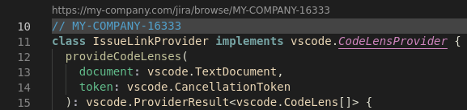

# issue-linkifier - VSCode extension

Generates clickable links above matching string patterns.

## Build

```sh
yarn
yarn global add vsce
vsce package
```

Use command: `Extensions: Install from VSIX...`

## Configuration

```json
{
  "issueLinkifier.entries": {
    "my-company": {
      "pattern": "MY-COMPANY-[0-9]+",
      "url": "https://my-company.com/jira/browse/"
    },
    ...
  }
}
```

## Preview


